# Homework 1

For question 1 to 4 please cd to `Q1-4/` then run `python Question1-4ui.py`.

## Question 1
### 1.1 Corner Detection 

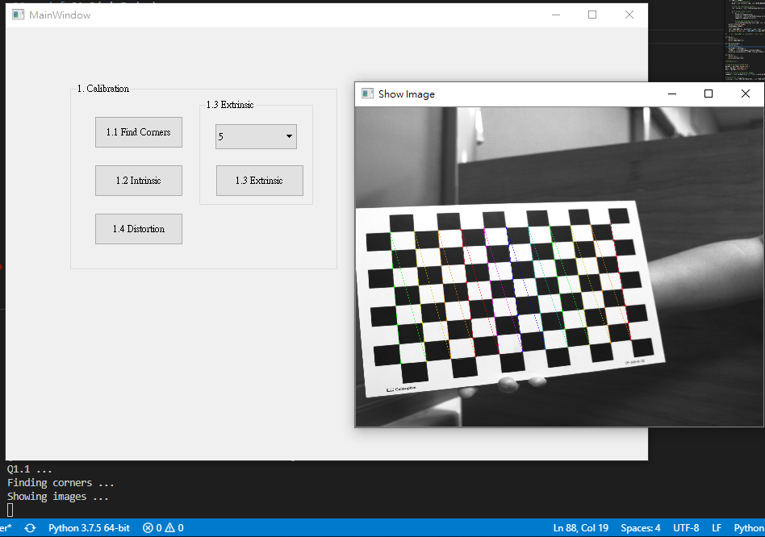

### 1.2 Find the Intrinsic Matrix  

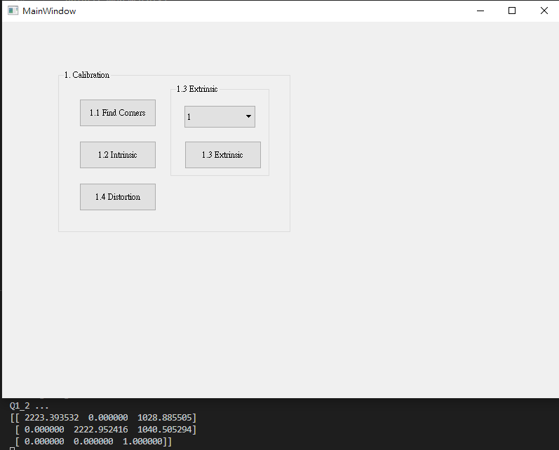

### 1.3 Find the Extrinsic Matrix  

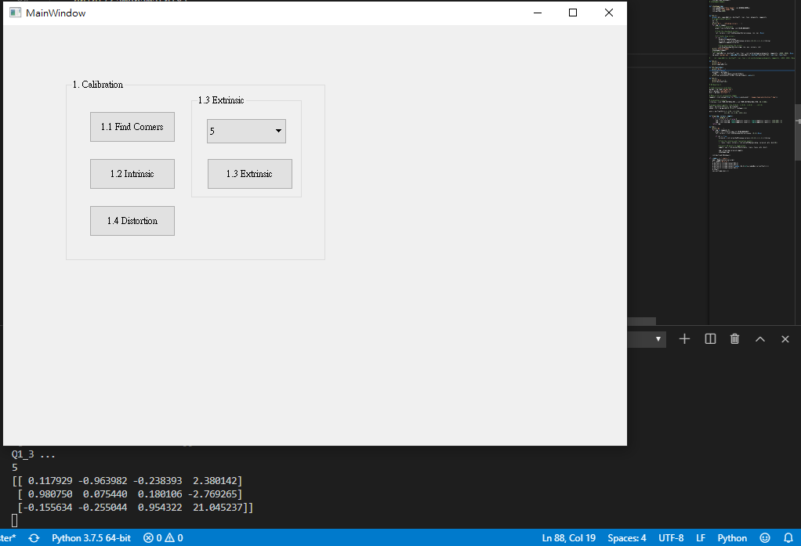

### 1.4 Find the Distortion Matrix  

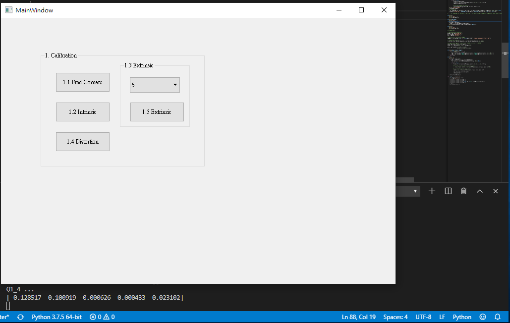

## 2. Augmented Reality  

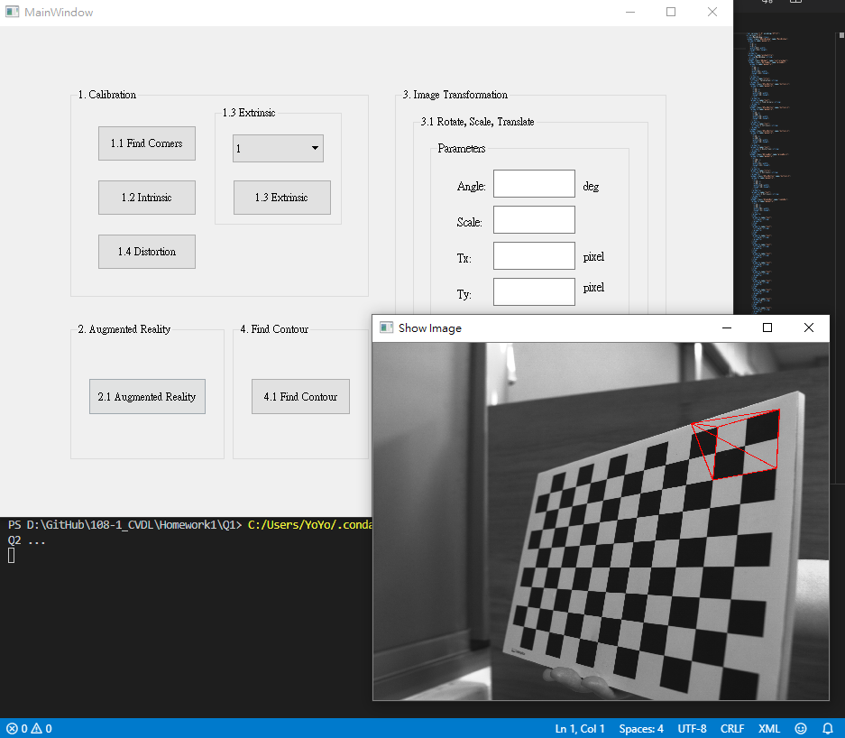

## Question 3

### 3.1 Transforms: Rotation, Scaling, Translation

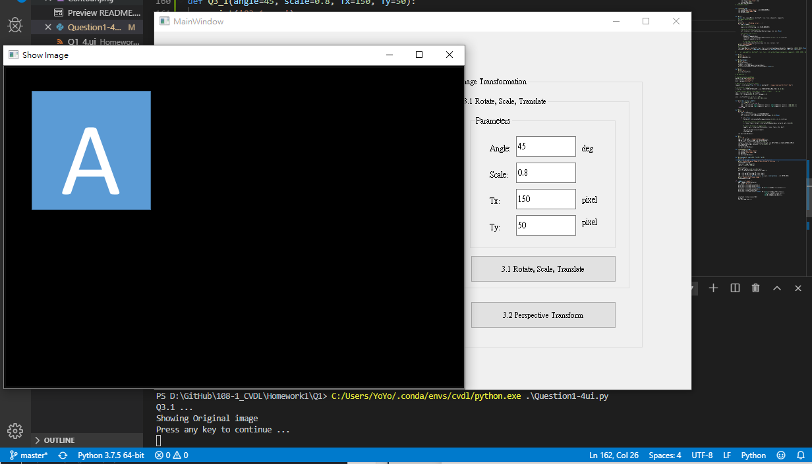

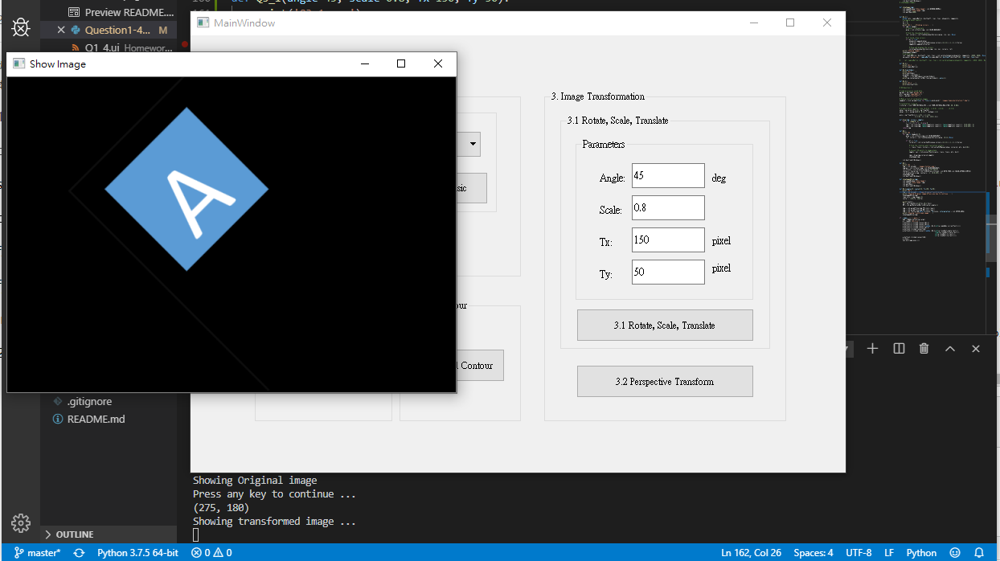

### 3.2 Perspective Transformation   

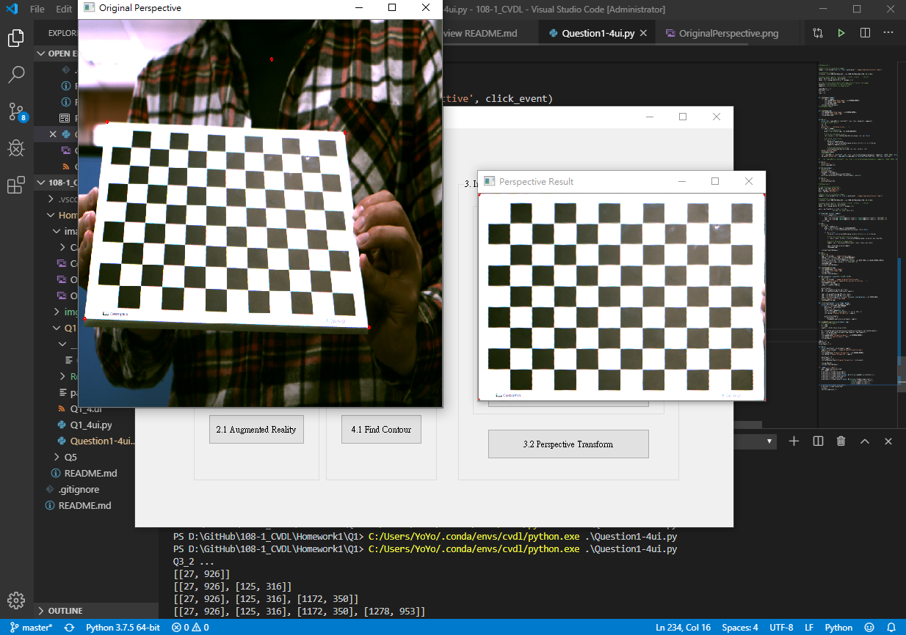

## Question 4 Find Contour  

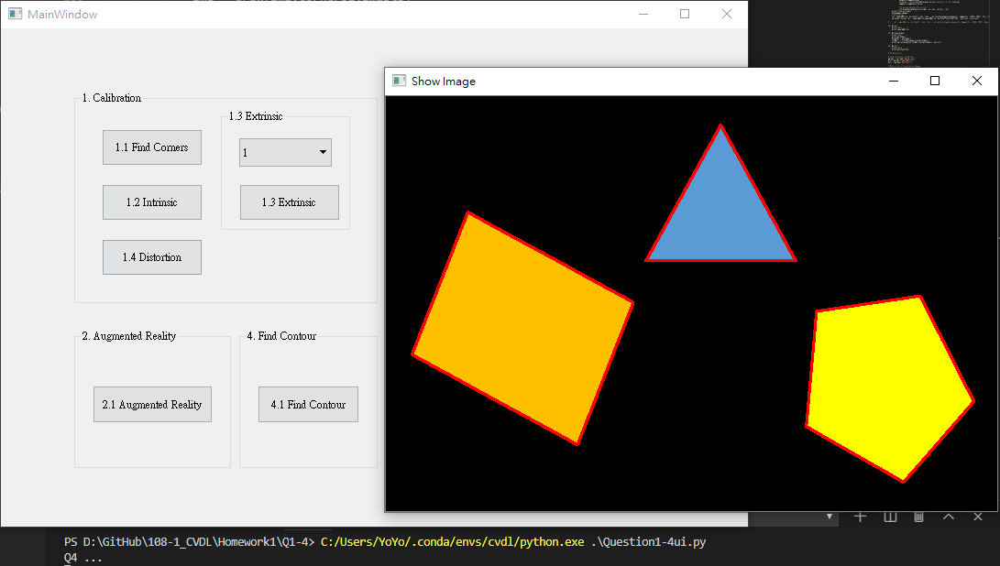

## Question 5
Train Cifar-10 Classifier Using LeNet-5 

Please cd to `Q5/` and run `python Question5ui.py` , then the UI will show.

Note: 5.4 takes a long time to train, DON'T PRESS the button.
5.4 Screenshot will be provided below.

### 5.1 Show Train Images

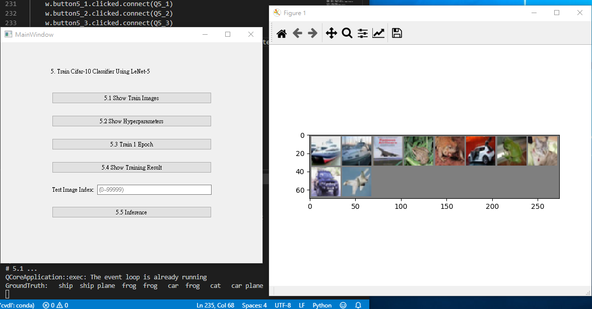

### 5.2 Show Hyperparameters

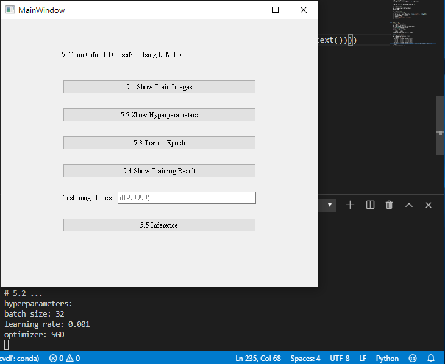

### 5.3 Train 1 Epoch

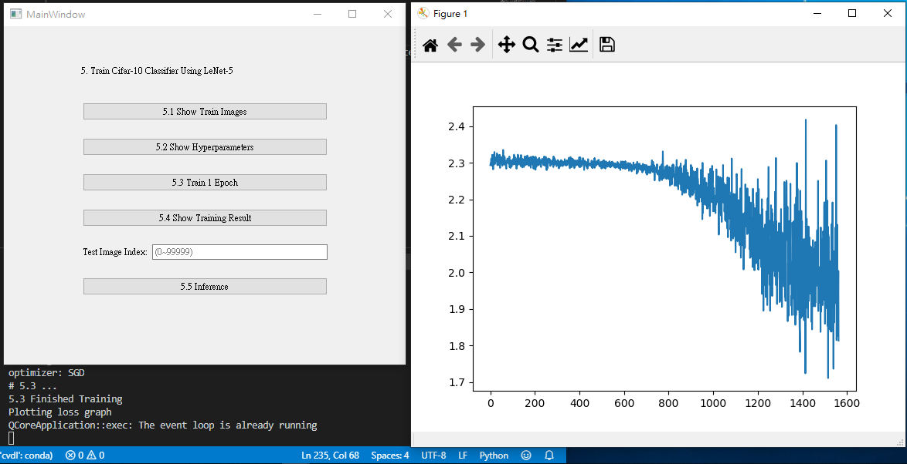

### 5.4 Show Training Result

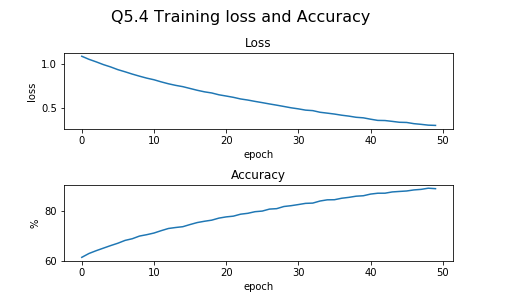

### 5.5 Inference
**Remember to type the index**

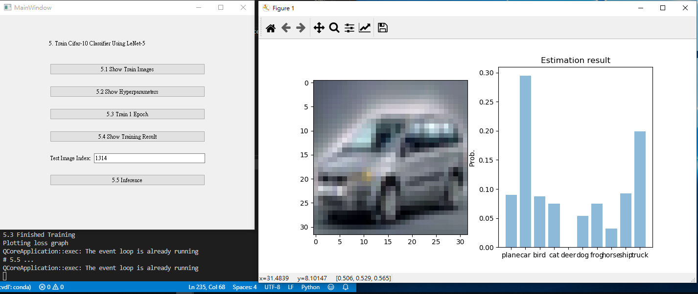