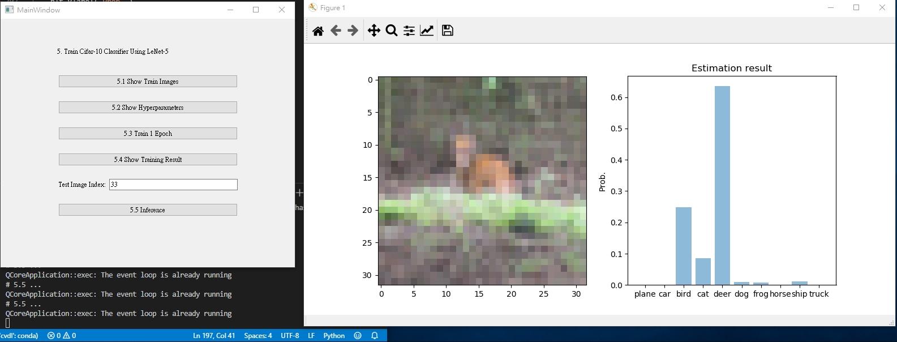

# Homework 1

## Question 1 & 2
For question 1 and 2 please run `python Question1-4ui.py`.

### 1.1 Corner Detection 

### 1.2 Find the Intrinsic Matrix  

### 1.3 Find the Extrinsic Matrix  

### 1.4 Find the Distortion Matrix  

### 2. Augmented Reality  

## Question 5
Train Cifar-10 Classifier Using LeNet-5 

Please run `python Question5ui.py` , then the UI will show.

Note: 5.4 takes a long time to train, DON'T PRESS the button.
5.4 Screenshot will be provided below.

### 5.1 Show Train Images

### 5.2 Show Hyperparameters

### 5.3 Train 1 Epoch

### 5.4 Show Training Result

### 5.5 Inference
**Remember to type the index**

